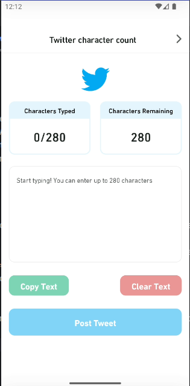
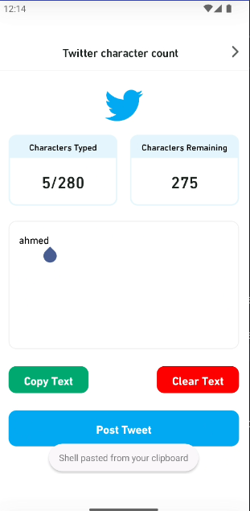
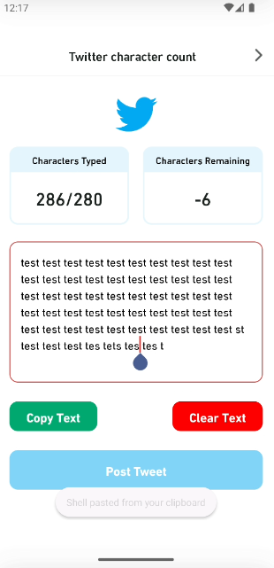

# Twitter Character Count

A simple Android application that integrates with the Twitter API to count and display the number of characters in a tweet before posting it. This app demonstrates how to use the Twitter SDK for authentication and posting tweets, and also includes functionality to ensure that tweets comply with Twitter's character limit.

## Features

- **Twitter Authentication**: Log in to Twitter using OAuth.
- **Character Count**: Display the number of characters in a tweet and show a warning if the tweet exceeds the limit.
- **Post Tweets**: Compose and post tweets directly from the app.
- **UI with Jetpack Compose**: Modern UI using Jetpack Compose.

## Prerequisites

- **Twitter Developer Account**: You need a Twitter Developer account and API keys.

## Technologies

- Kotlin
- retrofit
- Android Jetpack
    - MVI
    - Compose
- Hilt for Dependency Injection
- Coroutines for Asynchronous Programming
- Mockito for Unit Testing
- JUnit for Testing

## Architecture

The application follows the Model-View-ViewModel (MVVM) architecture pattern to separate concerns and ensure a clean codebase. The primary components are:

- **MVI**: Handle the logic and interact with repositories to fetch data.
- **Repositories**: Abstract the data source and provide data to ViewModels.
- **Views**: Android Compose UI.

## Screenshots
|  |  |  |_

